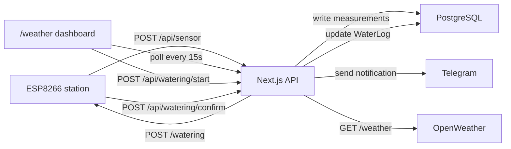

# BlackStage Alpha

BlackStage Alpha - pet-проект домашней IoT-системы для мониторинга микроклимата и ухода за комнатными растениями.

Приложение собирает данные с домашней станции на ESP8266, хранит историю измерений в PostgreSQL, показывает актуальные показатели в веб-интерфейсе и умеет запускать сценарий полива через внешний контроллер. Дополнительно система подтягивает наружную погоду из OpenWeather, отправляет уведомления в Telegram и защищает API rate limiting'ом на Redis.

## Что умеет проект

- Показывает дашборд микроклимата: температуру, влажность и уровень освещенности.
- Сравнивает домашние показатели с погодой на улице через OpenWeather.
- Хранит измерения домашней станции и влажности почвы в PostgreSQL.
- Ведет профиль растений: описание, требования к свету, температуре и поливу.
- Показывает актуальную влажность почвы по каждому растению.
- Запускает полив одного растения или всех растений в зависимости от режима `WATERING_MODE`.
- Ведет журнал поливов со статусами `PENDING`, `SUCCESS`, `FAILED`, `MANUAL`.
- Принимает подтверждение полива от станции.
- Проверяет доступность ESP8266.
- Отправляет Telegram-уведомления по данным сенсоров и ошибкам полива.
- Ограничивает частоту обращений к `/api/*` через Redis.

## Технологический стек

- **Frontend:** Next.js 16, React 19, TypeScript, Tailwind CSS 4, shadcn/ui, lucide-react, motion.
- **State management:** Zustand.
- **Backend:** Next.js Route Handlers.
- **Database:** PostgreSQL, Prisma 7, `@prisma/adapter-pg`.
- **Cache / rate limiting:** Redis sorted sets.
- **Integrations:** ESP8266 station API, OpenWeather API, Telegram Bot API.
- **Date/time:** Luxon.
- **HTTP client:** Axios.
- **Architecture:** Feature-Sliced Design в адаптации под Next.js App Router.

## Архитектура

Проект разделен на слои по FSD:

```text
app/                         Next.js App Router: страницы, layout, API route handlers
src/app/                     провайдеры, middleware, реализации API-роутов
src/pages/                   страницы уровня FSD: home, weather, not-found
src/widgets/                 крупные блоки интерфейса страницы
src/features/                пользовательские сценарии и бизнес-фичи
src/entities/                доменные сущности, например weather
src/shared/                  общие API-клиенты, БД, UI, хуки, lib, config
src/shared/db/schema.prisma  схема данных Prisma
```

Основной пользовательский маршрут - `/weather`. Корневой маршрут `/` редиректит на него.

Высокоуровневый поток данных:



## Доменная модель

### Weather

Снимок данных домашней метеостанции:

- `temperature` - температура в помещении.
- `humidity` - влажность воздуха.
- `illumination` - уровень освещенности.
- `measuredAt` - время измерения на стороне станции.

### Plant

Комнатное растение. Имеет уникальный `title`, профиль, историю влажности почвы и журнал полива.

### PlantProfile

Описание растения и правила ухода:

- название и латинское название;
- изображение;
- описание;
- требования к свету, температуре и поливу;
- интервал полива в днях.

### SoilMoisture

Измерение влажности почвы для конкретного растения.

### WaterLog

Событие или задача полива:

- `PENDING` - задача полива создана, подтверждение от станции еще не пришло;
- `SUCCESS` - станция подтвердила успешный полив;
- `FAILED` - запрос к станции завершился ошибкой;
- `MANUAL` - полив зафиксирован вручную.

`batchId` используется для группировки массового полива.

## API

Все маршруты находятся под `/api`. Middleware применяет rate limiting ко всем `/api/:path*`.

### `GET /api/weather`

Возвращает последние комнатные измерения из БД и текущую наружную погоду из OpenWeather.

Пример ответа:

```json
{
  "indoor": {
    "temperature": 24.7,
    "humidity": 45,
    "illumination": 320,
    "date": "2026-06-25T19:04:28.000Z"
  },
  "outdoor": {
    "temp": 18.2,
    "feelsLike": 17.6,
    "humidity": 61,
    "pressure": 1012,
    "windSpeed": 3.4,
    "time": "2026-06-25T19:00:00.000Z"
  }
}
```

Если один из источников недоступен, endpoint возвращает доступную часть данных. Если недоступны оба источника, возвращается `404`.

### `POST /api/sensor`

Принимает данные от домашней станции и сохраняет их в БД.

Требует заголовок:

```http
X-API-Key: <STATION_API_KEY>
```

Пример тела запроса:

```json
{
  "temperature": 24.7,
  "humidity": 45,
  "illumination": 320,
  "measured": "2026-06-25T22:04:28+03:00",
  "plants": [
    {
      "title": "Ньютон",
      "soilMoisture": 470
    }
  ]
}
```

Успешный ответ: `204 No Content`.

### `GET /api/soil-moisture`

Возвращает последнее измерение влажности почвы по каждому растению.

```json
[
  {
    "title": "Ньютон",
    "value": 470,
    "date": "2026-06-25T19:04:28.000Z"
  }
]
```

### `GET /api/plants`

Возвращает список растений, их профили и последнее состояние полива.

### `POST /api/watering/start`

Создает задачу полива и отправляет команду на станцию.

Пример тела запроса:

```json
{
  "title": "Ньютон"
}
```

Поведение зависит от `WATERING_MODE`:

- `ONE` - создается задача полива только для переданного растения;
- `ALL` - создаются задачи полива для всех растений.

Endpoint проверяет, что полив не запущен слишком рано. Окно раннего запуска задается переменной `NEXT_PUBLIC_WATERING_EARLY_ACCESS_DAYS`.

Успешный ответ: `204 No Content`.

### `POST /api/watering/confirm`

Принимает подтверждение от станции или фиксирует ручной полив.

Требует заголовок:

```http
X-API-Key: <STATION_API_KEY>
```

Подтверждение задач полива:

```json
{
  "waterLogs": [1, 2, 3]
}
```

Фиксация ручного полива по растениям:

```json
{
  "plants": ["Ньютон"]
}
```

Успешный ответ: `204 No Content`.

### `GET /api/status-station`

Проверяет доступность станции через `STATION_API_URL/status`.

Успешный ответ: `204 No Content`.

## Переменные окружения

Создайте `.env` на основе `.env.example`.

| Переменная                               | Назначение                                                                     |
| ---------------------------------------- | ------------------------------------------------------------------------------ |
| `DATABASE_URL`                           | Строка подключения к PostgreSQL.                                               |
| `REDIS_URL`                              | Строка подключения к Redis.                                                    |
| `RATE_LIMIT_MAX`                         | Максимальное количество запросов в окно rate limiting'а. По умолчанию `10`.    |
| `RATE_LIMIT_WINDOW_MS`                   | Размер окна rate limiting'а в миллисекундах. По умолчанию `60000`.             |
| `TELEGRAM_API_URL`                       | Базовый URL Telegram Bot API.                                                  |
| `TELEGRAM_BOT_TOKEN`                     | Токен Telegram-бота.                                                           |
| `TELEGRAM_CHAT_ID`                       | ID чата для уведомлений.                                                       |
| `OPENWEATHER_API_URL`                    | Базовый URL OpenWeather API.                                                   |
| `OPENWEATHER_API_KEY`                    | API-ключ OpenWeather.                                                          |
| `NEXT_PUBLIC_CITY_COORDS_LAT`            | Широта города для OpenWeather.                                                 |
| `NEXT_PUBLIC_CITY_COORDS_LON`            | Долгота города для OpenWeather.                                                |
| `STATION_API_URL`                        | Базовый URL домашней станции.                                                  |
| `STATION_API_KEY`                        | Общий ключ авторизации между приложением и станцией.                           |
| `WATERING_MODE`                          | Режим полива: `ONE` или `ALL`.                                                 |
| `NEXT_PUBLIC_API_BASE_URL`               | Базовый URL API для клиентских запросов, например `http://localhost:3000/api`. |
| `NEXT_PUBLIC_TIMEZONE`                   | Таймзона интерфейса.                                                           |
| `NEXT_PUBLIC_WATERING_EARLY_ACCESS_DAYS` | За сколько дней до планового полива можно запустить полив вручную.             |

## Локальный запуск

### Требования

- Node.js 20+
- npm
- PostgreSQL
- Redis

### Установка

```bash
npm install
cp .env.example .env
```

Заполните `.env` значениями для PostgreSQL, Redis и внешних интеграций.

### Подготовка базы данных

```bash
npx prisma migrate dev
npm run prisma:generate
npm run prisma:seed
```

Seed создает тестовые данные по погоде, растение и стартовую историю влажности/полива.

### Запуск в dev-режиме

```bash
npm run dev
```

Приложение будет доступно на `http://localhost:3000`, основной экран - `http://localhost:3000/weather`.

### Production build

```bash
npm run build
npm run start
```

Скрипт `build` сначала выполняет `prisma generate`, затем собирает Next.js-приложение.

## Rate limiting

Rate limiting работает на Redis sorted sets:

- ключ строится из IP-адреса и pathname;
- старые события удаляются по sliding window;
- в ответ добавляются rate-limit headers;
- при недоступности Redis стратегия работает в режиме fail-open: запросы пропускаются, ошибка логируется.

Это осознанный эксплуатационный компромисс: временная проблема Redis не должна полностью отключать домашнюю панель и прием данных от станции.

## Интеграция со станцией

Приложение ожидает, что внешняя станция:

- отправляет измерения на `POST /api/sensor`;
- принимает команду полива на `POST <STATION_API_URL>/watering`;
- имеет healthcheck `GET <STATION_API_URL>/status`;
- подтверждает выполненный полив через `POST /api/watering/confirm`;
- использует тот же `STATION_API_KEY`, что и сервер приложения.

Команда полива отправляется на станцию в формате:

```json
{
  "title": "Ньютон",
  "waterData": [
    {
      "plant": "Ньютон",
      "waterLog": 1
    }
  ]
}
```

`waterLog` нужен станции, чтобы потом подтвердить конкретные задачи полива.

## Доступные npm-скрипты

| Скрипт                    | Назначение                                           |
| ------------------------- | ---------------------------------------------------- |
| `npm run dev`             | Запуск Next.js в режиме разработки.                  |
| `npm run build`           | Генерация Prisma Client и production-сборка Next.js. |
| `npm run start`           | Запуск production-сборки.                            |
| `npm run lint`            | Проверка ESLint.                                     |
| `npm run prisma:generate` | Генерация Prisma Client.                             |
| `npm run prisma:seed`     | Запуск seed-скрипта.                                 |
